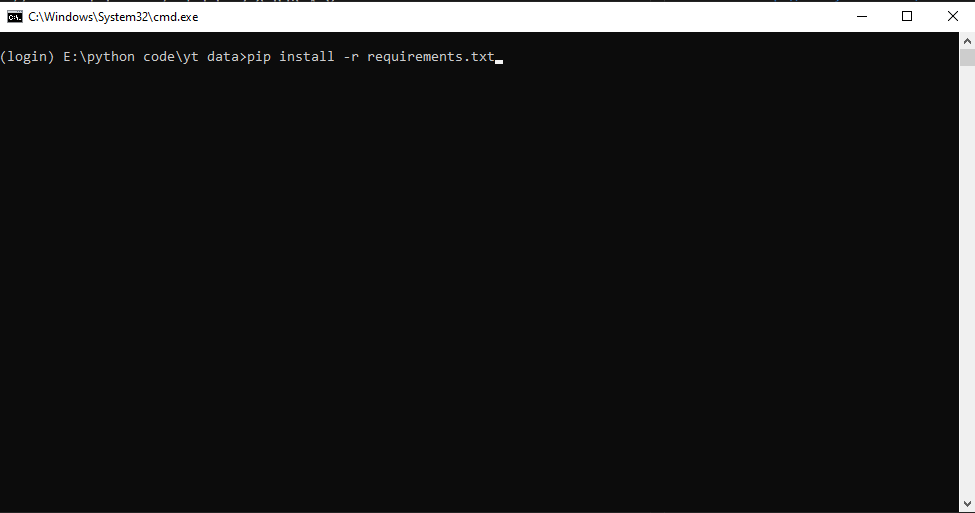

# For YouTube Creators (Educational Purpose)

### See in [Instagram](https://www.instagram.com/tv/CXqQ0tLFFTR/) video

### Watch this video (Tamil) 

1. https://www.youtube.com/watch?v=BKks3jF3kWU

2. https://www.youtube.com/watch?v=7c9eBJ2qAmY


### It will be scraped from YouTube channel pages to collect information such as the about page (join date, description, total views, location, total subscribers), and videos which are posted on your channel (video title, video link, views, isStreamed, relative time, duration). If you use the advanced mode, you will get all of this information, or otherwise normal. (**Note:** by default advanced mode is off).


#### REQUIREMENT:
- Download [Python](https://python.org) latest version.
- Install pip (Pip Installs Python)
    - To install pip. Run this command `python get-pip.py` or `pip install pip` 


#### PROCEDURE:
- Download the zip folder from Github and unzip it
Here is the link to download zip 👉
<a href='https://github.com/YezGotIt/source-code/raw/main/educational%20purpose/for%20youtube%20creators/for%20youtube%20creators.zip'>HERE</a>
- Open the folder in VS Code or 
- RUN, this command pulls out all the require modules:

- RUN, this command given below (Install the dependencies):
```
pip install -r requirements.txt
```

- RUN, this command given below (Run the app.py):
```
python app.py -l <channel link> -a <no>
```


 ### I have taken refernce from here:

 https://www.youtube.com/watch?v=zhkhdD2hkQw&t (English)

 https://www.youtube.com/watch?v=cgNQgcUgq0U&t (Hindi)

 https://www.youtube.com/watch?v=lxvr7zgNMWY (Hindi)

---
### Disclaimer:

 #### Use this code has an educational purpose only.


