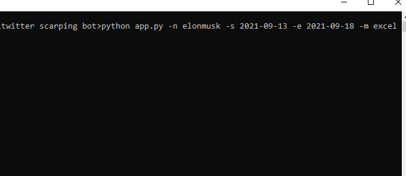

# Twitter Scraping Bot (Educational Purpose)

### It will be scraped a particular account timeline if you give the range of date (eg: 2021-09-13 to 2021-09- 18).


#### PROCEDURE:
- Download the zip folder from Github and unzip it
Here is the link to download zip 👉
<a href='https://github.com/YezGotIt/source-code/raw/main/educational%20purpose/twitter%20scarping%20bot/twitter%20scarping%20bot.zip'>HERE</a>
- Open the folder in VS Code or 
- RUN, this command pulls out all the require modules / cmd:
<br>

```
pip install -r requirements.txt
```


- RUN, this command given below:
```
// Date be should in this format **2021-09-18**
// Mode is excel || csv || both

python app.py -n <Account Name> -s <Start Date> -e <End Date>  -m <Mode>
```

 **-n** is name of the account
 <br>
 **-s** starting date [ 2021-09-13 ]
 <br>
  **-e** ending date [ 2021-09-18 ]
 <br>
 **-m** type excel or csv or both by  __default is csv__




 ## Disclaimer

 #### Use this code has an educational purpose only.
 
 ---
 
 ### This is project collaboration with <a href="https://github.com/NarutoNaresh">NarutoNaresh</a>
 
